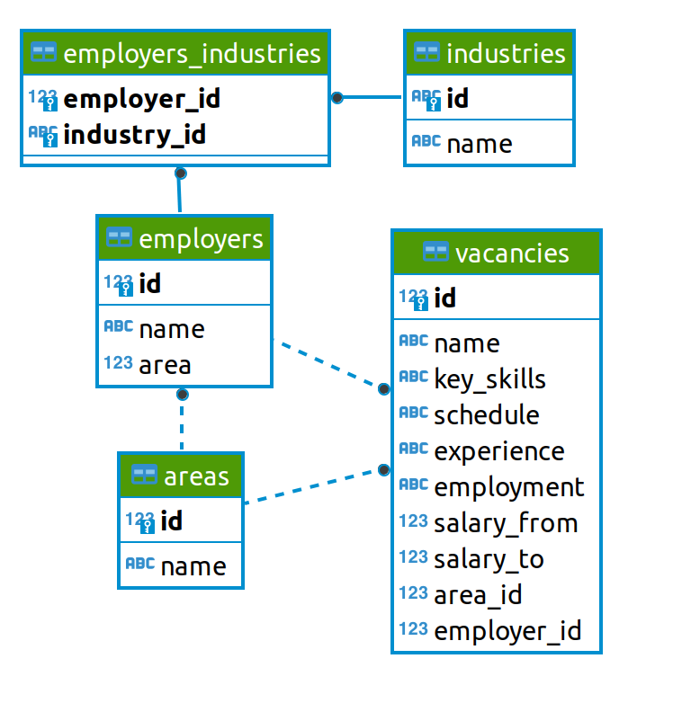

# <center> Проект анализ вакансий из HeadHunter </center>
## Оглавление
1. [Описание проекта](#Описание-проекта)
2. [Описание данных](#Описание-данных)
3. [Зависимости](#Зависимости)
4. [Установка проекта](#Установка-проекта)
5. [Использование проекта](#Использование-проекта)


## Описание проекта

**Проект** направлен на анализ выборки вакансий, размещенных на HeadHunter. Анализ данных в целом, количества работодателей, количества вакансий, региональной представленности. Более подробно анализируются вакансии в сфере Data Science, предъявляемые требования к кандидатам, вилка вознаграждения, требования к опыту работы, основные работодатели. 

**О структуре проекта:**
* [Project_2.ipynb](Project_2.ipynb) - jupyter-ноутбук, содержащий код проекта, в котором демонстрируются методы и подходы извлечения данных для анализа. 


## Описание данных
В проекте используются данные о вакансиях, размещенных на HeadHunter. Данные находятся в нескольких таблицах, взаимосвязь данных представлена на схеме:




## Используемые зависимости
* Python (3.9):
    * [numpy (1.20.3)](https://numpy.org)
    * [psycopg2](https://www.psycopg.org)
    * [pandas (1.3.4)](https://pandas.pydata.org)

## Установка проекта

```
git clone https://github.com/9340335/Project_2 

```

## Использование
Вся информация о работе представлена в jupyter-ноутбуке Project_2.ipynb.
